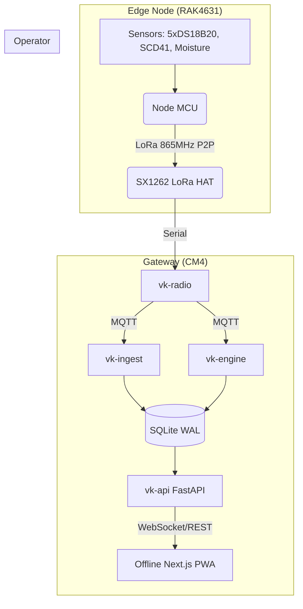

# Vermikendra System Architecture

## Contracts
- **Node-to-Gateway:** Custom binary payload over LoRa P2P (No LoRaWAN). 
- **Gateway Services:** Communicate purely via Mosquitto MQTT over `localhost`.
- **Database:** Strict SQLite schema (defined in `Schema.md`).
- **Dashboard:** Communicates via REST for historical data and WebSocket for real-time telemetry.
