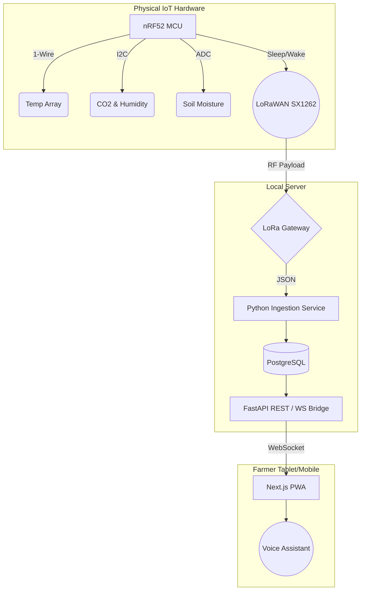

# 🌱 Vermikendra: High-Resilience Vermiculture Telemetry


[](https://dashboard-delta-eight-67.vercel.app/)

**🔗 Live Demo (Farmer UI):** [https://dashboard-delta-eight-67.vercel.app/](https://dashboard-delta-eight-67.vercel.app/)

Vermikendra is a deterministic, off-grid **Agricultural Monitoring and Telemetry System** designed specifically to optimize vermicomposting yields. It is engineered for zero-literacy usability, deploying robust IoT edge nodes that transmit critical soil metrics over LoRaWAN to a local, resilient dashboard.

---

## 📖 Project Overview

1. **Precision Agriculture at the Edge**: Vermikendra utilizes bare-metal C++ firmware deployed on Nordic nRF52/RAK4631 nodes, gathering real-time telemetry from DS18B20 temperature arrays, SCD41 CO2 sensors, and capacitive soil moisture probes.
2. **Zero-Literacy Farmer UI**: The frontend is deliberately simplified. Farmers are not burdened with complex graphs or data tables. Instead, they receive stark, color-coded binary state alerts (e.g., "Bed is too hot") alongside an accessible ambient voice interface.
3. **High-Resilience Architecture**: The system is built for rural environments with intermittent internet and power. The local Next.js frontend securely reflects the immutable ground truth stored in a local PostgreSQL backend, driven by a Python FastAPI bridge.

---

## 🏗️ System Architecture

The ecosystem relies on a three-tier architecture ensuring deterministic data flow from the soil bed to the farmer's tablet.



---

## 🚀 Quick Start (Local Simulation)

The repository includes a full-stack simulator that generates cryptographically accurate edge-node payloads, allowing the entire system to be run without physical hardware.

### 1. Start the Backend Gateway
*Prerequisite: PostgreSQL running locally on `localhost:5432` with a database named `vermikendra`.*

```bash
cd gateway
python -m venv venv
source venv/bin/activate  # On Windows: .\venv\Scripts\activate
pip install -r requirements.txt

# Start the API & WebSocket broker
python api.py
```

### 2. Start the Frontend Dashboard
```bash
cd dashboard
npm install
npm run dev
```
The UI is now accessible at [http://localhost:3000](http://localhost:3000).

### 3. Inject Simulated Telemetry
In a separate terminal, trigger the hardware simulator to stream sensor payloads into the PostgreSQL backend. The React dashboard will instantly update in real-time.

```bash
cd gateway
source venv/bin/activate
python simulator.py
```

---

## 🛠️ Firmware Build

The physical edge-node C++ firmware is built using **PlatformIO**, targeting the Nordic nRF52 ARM Cortex-M4F architecture.

```bash
cd firmware
pio run
```
*Dependencies (handled automatically): RadioLib (SX1262 LoRaWAN), DallasTemperature, Sensirion I2C SCD4x, Adafruit LIS3DH.*

---

## 📂 Repository Structure

- `/dashboard`: Next.js React frontend (Farmer UI).
- `/gateway`: Python FastAPI backend, database models, and payload simulator.
- `/firmware`: C++ PlatformIO source code for physical IoT edge nodes.
- `/docs`: Extensive documentation, forensic validation reports, and architecture decisions.
- `/presentation`: Project presentation assets, slide generator scripts, and graphics.
- `/hardware`: Electronic schematics and CAD references.

---

## 📜 License
*Proprietary / Academic Project Submission*
