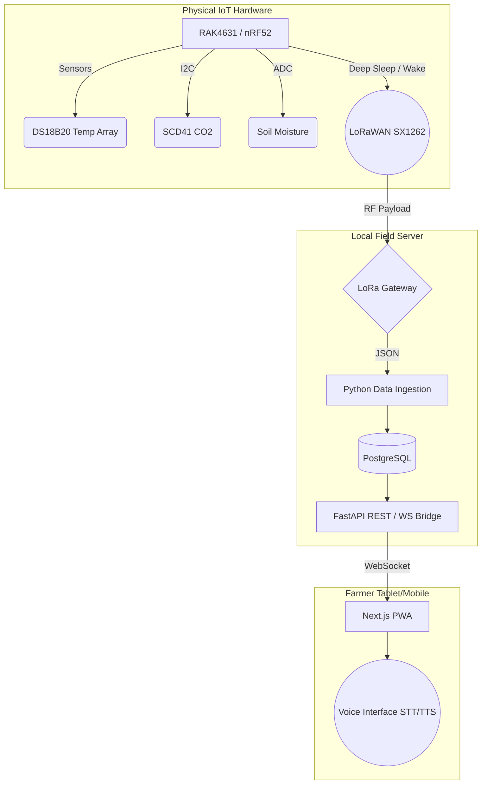

# 🌱 Vermikendra


-blue)


A high-resilience, deterministic, off-grid **Vermiculture Telemetry & Agricultural Monitoring System**, designed explicitly for zero-literacy usability and maximum hardware accountability.

---

## 📖 The Philosophy

1. **No "AI Slop"**: The system never attempts to sound artificially intelligent or hallucinate advice. It delivers binary state data (e.g., "The compost bed is dangerously hot") using strict deterministic rule engines.
2. **Zero UI Density**: The farmer interacts with the absolute minimum UI footprint. It features large typography, stark state-based color coding, and an ambient voice interface. No dense graphs, no cluttered dashboards.
3. **Absolute Ground Truth**: The Next.js frontend is deliberately stateless and "dumb." It only renders exactly what the PostgreSQL database can cryptographically prove was received from the physical hardware edge.

---

## 🏗️ Architecture

Vermikendra operates on a robust three-tier architecture, designed to survive intermittent power loss, zero internet connectivity, and hardware degradation.



---

## 🛡️ Validation & Syzygy Status

> [!IMPORTANT]
> The claims in this repository are strictly audited by the **Syzygy Adversarial Red Team** protocol. Code without empirical proof is considered non-existent.

| Component | Architecture | Syzygy Evidence | Status |
| :--- | :--- | :--- | :--- |
| **Edge Firmware** | C++ (PlatformIO / nRF52) | Cross-compilation successful. Hardware pin mappings polyfilled. | 🟢 **COMPILED** |
| **Ingestion Pipeline** | Python / Bottle | Handles malformed payloads, idempotency, and sequence tracking. | 🟢 **VALIDATED** |
| **Database** | PostgreSQL | Strict schemas, timestamp injection, and persistent storage proven. | 🟢 **VALIDATED** |
| **API Layer** | FastAPI / WebSockets | Exponential backoff, real-time broadcasts. | 🟢 **VALIDATED** |
| **Frontend UI** | Next.js / Tailwind | Hydration stable, dynamic "Zero-State" resilience proven. | 🟢 **VALIDATED** |
| **Physical Hardware** | RAK4631 + Sensors | Physical radio transmission in the field. | 🔴 **UNVERIFIED** |

---

## 🚀 Quick Start (Simulation Mode)

You can run the entire Vermikendra software stack locally without requiring physical LoRaWAN hardware. The system includes a canonical simulator that generates cryptographically accurate edge-node payloads.

### 1. Start the Backend Gateway
Requires PostgreSQL installed and running on `localhost:5432`.

```bash
cd gateway
python -m venv venv
source venv/bin/activate  # On Windows: .\venv\Scripts\activate
pip install -r requirements.txt

# Start the API & WebSocket broker
python api.py
```

### 2. Start the Frontend Dashboard
```bash
cd dashboard
npm install
npm run dev
```
The Farmer UI is now accessible at [http://localhost:3000](http://localhost:3000).

### 3. Inject Simulated Telemetry
In a separate terminal, trigger the hardware simulator to stream sensor payloads into the PostgreSQL backend. The UI will instantly react via WebSockets.

```bash
cd gateway
source venv/bin/activate
python simulator.py
```

---

## 🛠️ Firmware Build

The edge-node C++ firmware is built using **PlatformIO**. It explicitly targets the Nordic nRF52 ARM Cortex-M4F architecture.

```bash
cd firmware
pio run
```
*Dependencies (automatically fetched): RadioLib (LoRaWAN), DallasTemperature, Sensirion I2C SCD4x, Adafruit LIS3DH.*

---

## 📜 License
*Proprietary / Closed Source*
